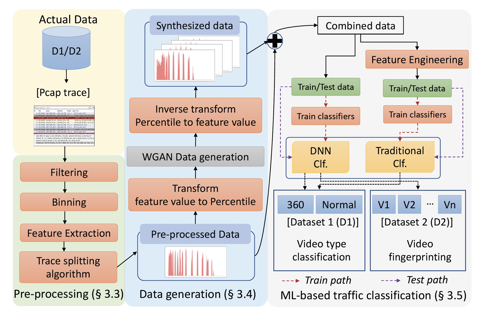
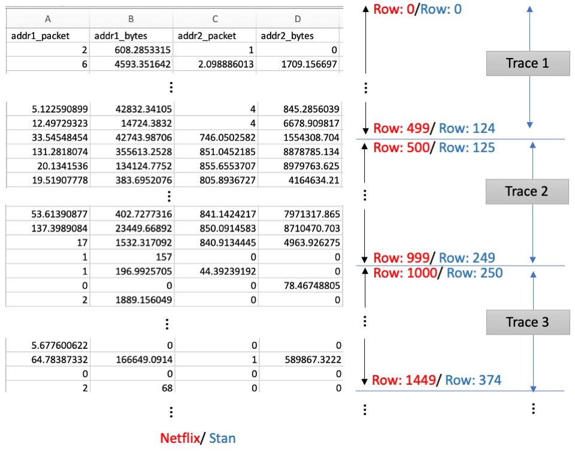

# videoTrainplusplus
Code repository for the work "VideoTrain++: GAN-Based Adaptive Framework for Synthetic Video Traffic Generation" published in Elsevier Computer Networks.

## Requirements
Following packages are required.

* Numpy				
*	Pandas			
*	matplotlib
* Seaborn         0.11.1
* tensorflow      2.0.0
* scipy           1.4.1

## Breif overview of OpCASH
Video streaming traffic has been dominating the global network and the challenges have exacerbated
with the gaining popularity of interactive videos, a.k.a.360  videos, as they require
more network resources. However, effective provision of network resources for video streaming
traffic is problematic due to the inability to identify video traffic flows through the network
because of end-to-end encryption. Despite the promise given for network security and privacy,
end-to-end encryption also provides a shield for adversaries. To this end, encrypted traffic classification
and content fingerprinting with advanced Machine Learning (ML) methods have been
proposed. Nevertheless, achieving high performance requires a significant amount of training
data, which is a challenging task in operational networks due to the sheer volume of traffic and
privacy concerns. As a solution, in this paper, we propose a novel Generative Adversarial Network
(GAN) based data generation solution to synthesize video streaming data for two different
tasks, 360 /normal video classification and video fingerprinting. The solution consists of
a percentile-based data mapping mechanism to enhance the data generation process, which is
further supported by novel algorithms for data pre-processing and GAN model training. Taking
over 6600 actual video traces and generating over 150,000 new traces, our ML-based traffic
classification results show a 5–16% of accuracy improvement in both tasks.

Overall process and sample tile configuration (Cache+CS) to cover a requested VP

 

## Run the script
To run the script clone the repository to your local repository and install the required packages above. 

* To run the Netflix generation, run the command
`python3 start_generation_Netflix.py`

* To run the Stan generation, run the command
`python3 start_generation_Stan.py`

## How the code works

* Folder **data** contains sample two actual traces of Netflix and Stan traces we used in VideoTrain++. YouTube data generation is similar to Stan data generation. All the GAN models used in data generation are coded in relevant scripts. 
* Synthesized traces are stored in `data` folder under `synth` subfolder. For both Netflix and Stan, codes generate *n* number of traces in one `.csv` file. Users can separate these traces as follows. Each row of the `.csv` file represents a bin of the trace. Below figure further explains the process.
    * Netflix: split the `.csv` files every 500 rows, because a Netflix trace contains 500 bins
    * Stan: split the `.csv` files every 125 rows, because a Stan trace contains 125 bins
    
 Trace extraction from the synthesized `.csv` file

 
* To see the comparison between actual and synthesized traces in terms of KDE and temporal plots run `python draw_temporal_and_kde_plots_Netflix.py` and `python draw_temporal_and_kde_plots_Stan.py`.

We will update the code repo soon. Basic implementation of  VideoTrain++ can be found in https://github.com/manojMadarasingha/videoTrain.
